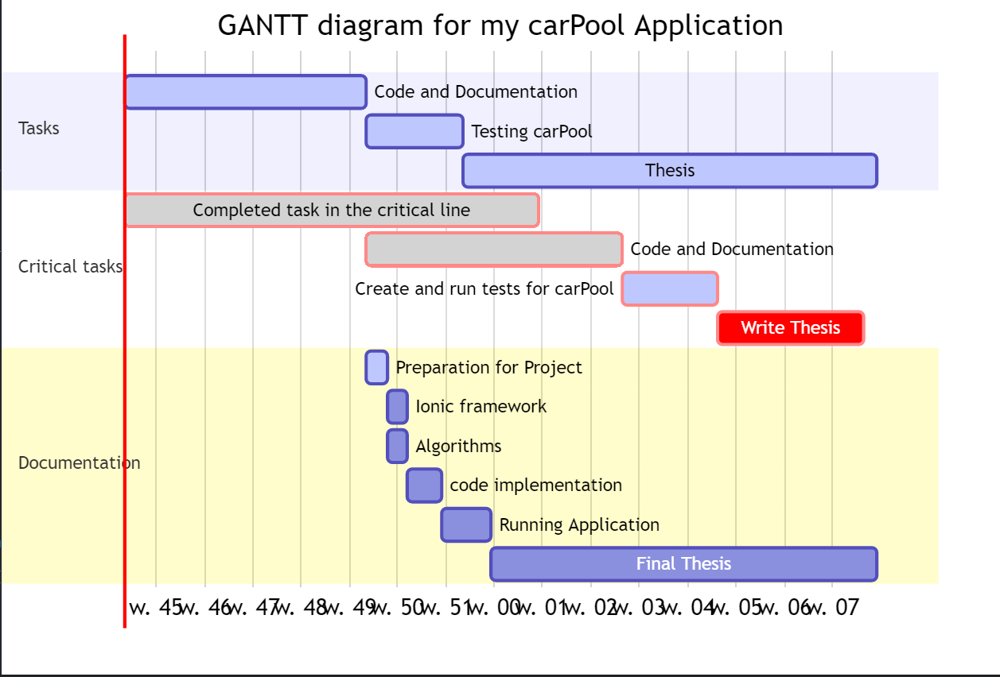

<!-- slide -->
# My Carpool Application
An Application I am building for my final year project.
<!-- slide -->
# software overview
 For this project I am building my application using   Ionic. Ionic is an open source mobile app framework that allows you to build apps easily. I am running Ionic through the server framework node.js.
The software side to this project will involve searching and matching  algorithms  for carpooling  of which I will  implement using Google Maps API.
<!-- slide -->
#writing overview
When writing for my project I am using Google Docs as my editor. I am keeping a diary of the tasks that I undertake on a week to week basis through daily diaries, in this diary I am submitting my progress through achievements and errors and I am submitting screenshots and images accordingly. I hope that by keeping an account of my daily progress this will lead to a much easier transition when converting my Google Docs diary of my project into writing my final thesis.
<!-- slide -->
#gantt chart
<!-- slide -->
#summary
So far I am happy with the progression of my project, while I have had plenty of difficulties I am managing to successfully work my way through them. I have documented everything that I have done so far and am confident for my future progression of my carPool Application.
